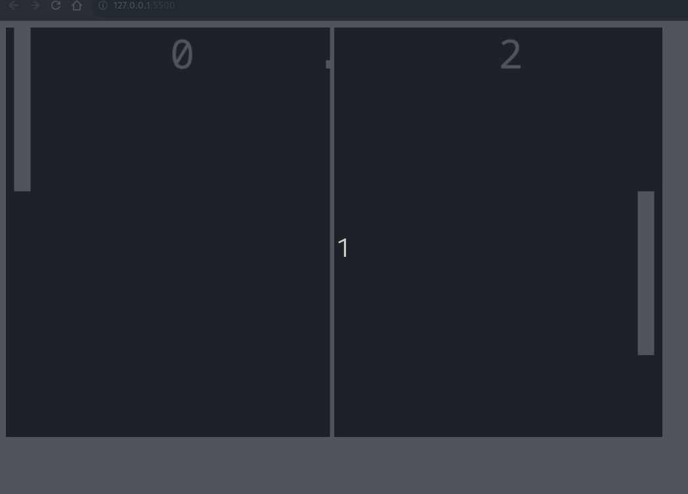

# Projeto de jogo - Pong

O projeto do jogo pong foi criado para demonstrar um dos jogos mais conhecidos. Sua história inicia na 1º geração de games, antes mesmo dos consoles. O pong é um clássico que até hoje é jogado. 

## Projeto

### Comandos

O jogo é simples. Para jogá-lo, utilizam-se as teclas:

<table border="1">
    <thead>
        <tr>
            <th colspan="2">Jogador 1</th>
            <th colspan="2">Jogador 2</th>
        </tr>
    </thead>
    <tbody>
        <tr>
            <td><em><b>Tecla s</b></em></td>
            <td>Tecla para baixar a plataforma</td>
            <td><em><b>seta para baixo</b></em></td>
            <td>Tecla para baixar a plataforma</td>
        </tr>
        <tr>
            <td><em><b>Tecla w</b></em></td>
            <td>Tecla para subir a plataforma</td>
            <td><em><b>seta para cima</b></em></td>
            <td>Tecla para subir a plataforma</td>
        </tr>
    </tbody>
</table>

